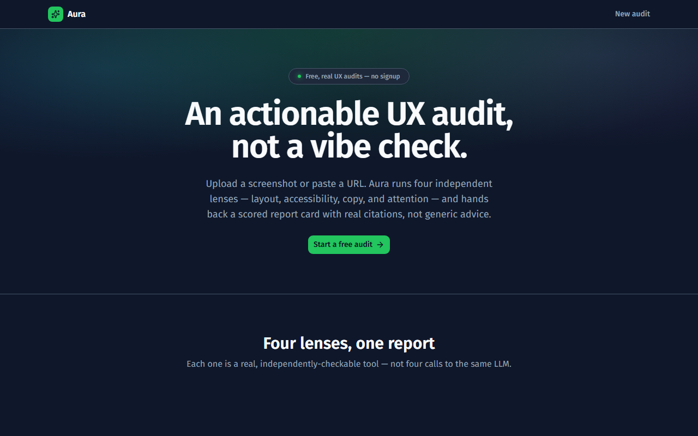
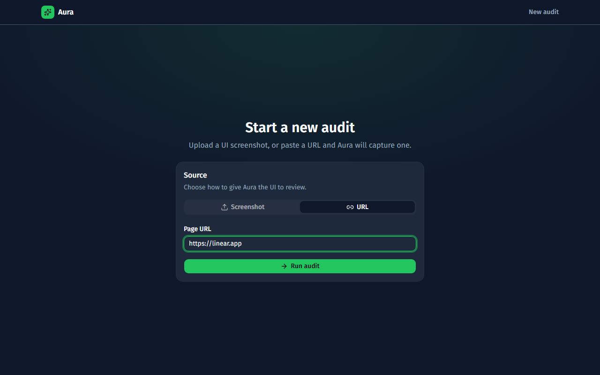
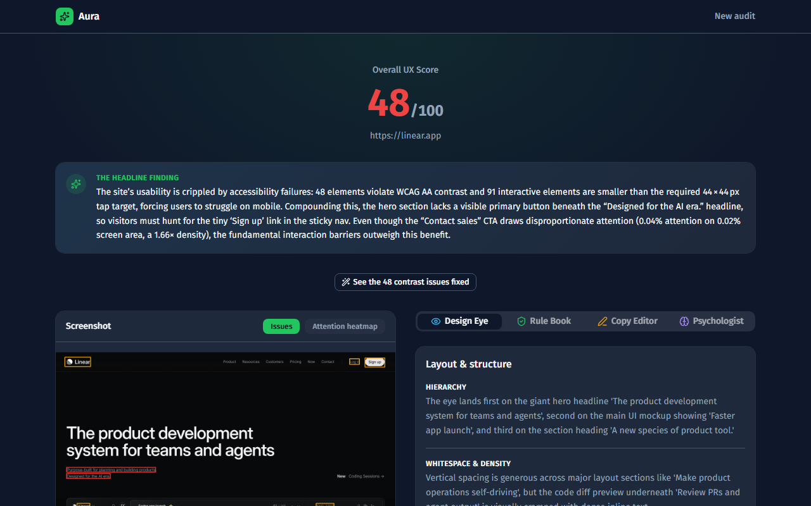
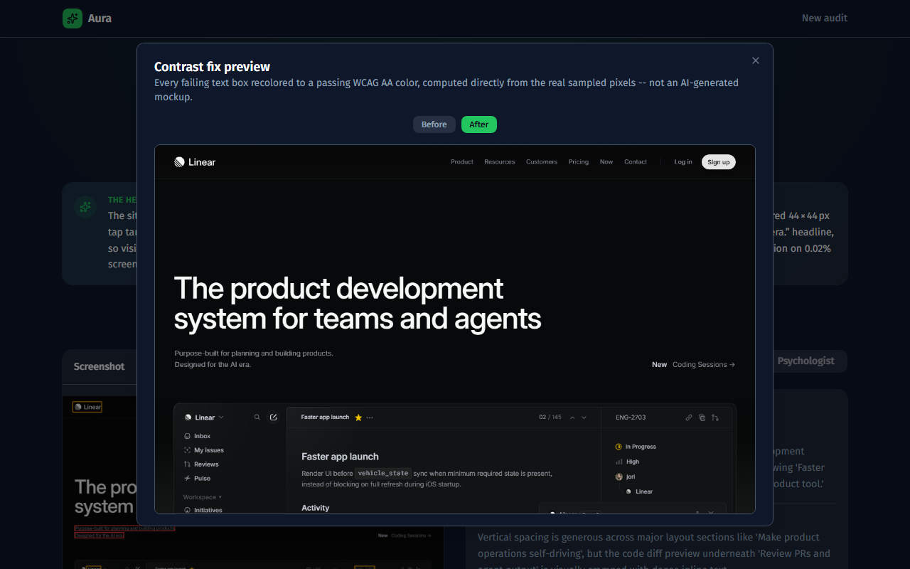
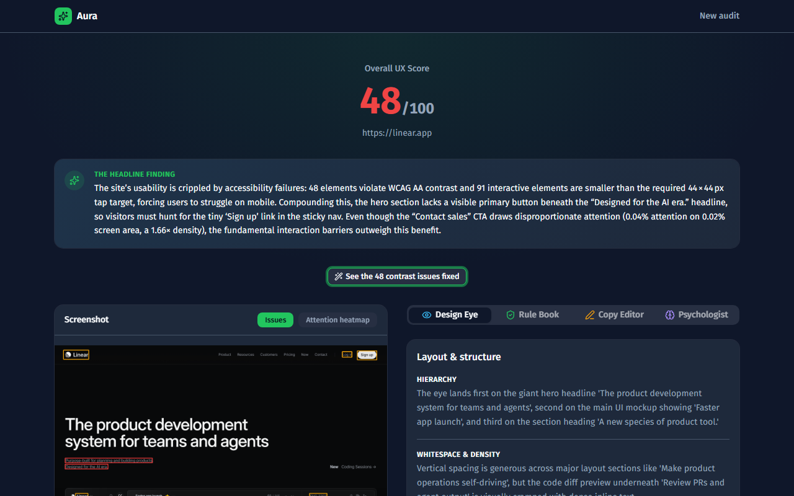
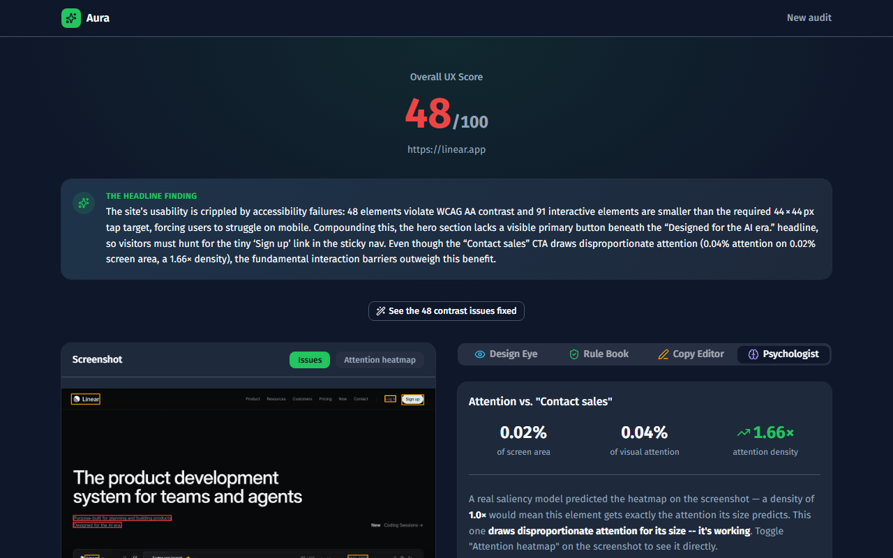
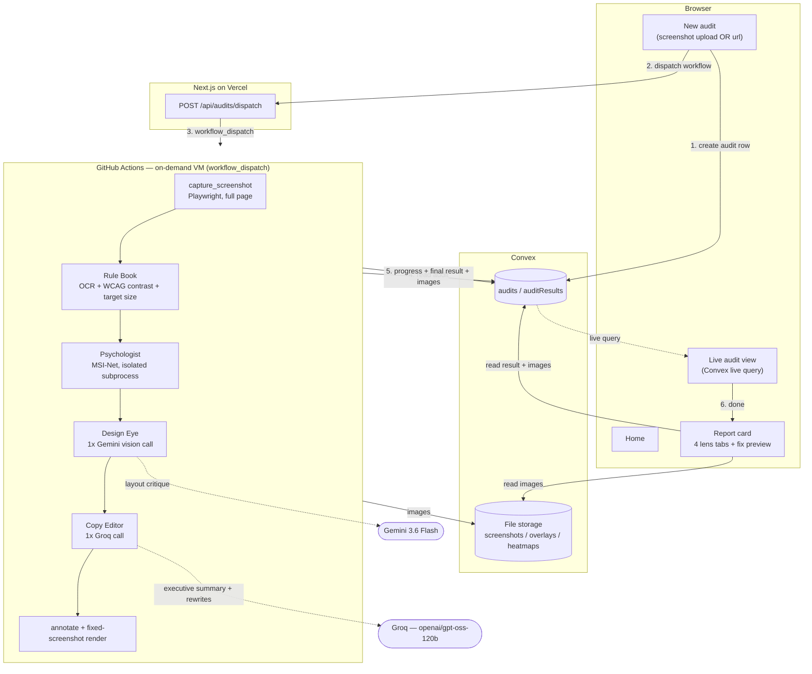

# Aura — AI UX Auditor

**Live app:** [ai-ux-auditor-inky.vercel.app](https://ai-ux-auditor-inky.vercel.app/)

An AI UX-audit agent: upload a UI screenshot or paste a URL, and get back a scored report card with concrete, cited feedback across four independent lenses — layout, accessibility, copy, and attention. Every finding traces back to something checkable — a real WCAG contrast ratio, a pixel region, a specific sentence — not a vague "looks clean and modern" from an LLM.

The point isn't a fourth chatbot opinion on your UI. Vision models are genuinely useful for *qualitative* judgment (hierarchy, whitespace, whether a CTA reads as dominant), but they're unreliable at *quantitative* judgment (exact contrast ratios, precise pixel dimensions, where a saliency model's attention actually peaks) — and a UX audit tool that fabricates those numbers is worse than useless. So Aura splits the work: three of the four lenses are pure deterministic code (WCAG math on sampled pixel colors, OCR-measured tap-target sizes, a real saliency model's attention-vs-CTA overlap), and only the fourth — qualitative layout critique — is an LLM call at all.

## How it works

```
input (screenshot upload OR url)
  → if url: full-page Playwright capture (SSRF-validated)
  → PaddleOCR                                    [deterministic] → text + pixel bounding boxes
  → Rule Book: WCAG contrast + target-size        [deterministic] → real sampled-pixel contrast ratios,
                                                                     Otsu-thresholded glyph masks, 44×44px
                                                                     tap-target check
  → readability scoring + overall score           [deterministic]
  → Psychologist: MSI-Net saliency heatmap         [real CV model] → attention-vs-CTA density ratio
                                                                      (1.0 = proportional to size)
  → Design Eye: 1× Gemini vision call              [AI] → hierarchy / whitespace / CTA / one concrete flaw,
                                                           structured JSON, quoting actual visible text
  → Copy Editor: 1× Groq call                      [AI] → executive summary + copy rewrites, synthesized
                                                           from every other lens's real findings
  → render: issue overlay + saliency heatmap +
    deterministic "see it fixed" contrast preview  [deterministic]
  → persist to Convex
```

Exactly two AI calls per audit, both bounded — the Groq call does more work per call (summary + rewrites together) rather than adding a third.

## Screenshots

*All screenshots below are the actual deployed app at the URL above, auditing the real [linear.app](https://linear.app) — not mockups.*

**Home and a real audit in progress:**

| | |
|---|---|
|  |  |

**The report card — real score, and a headline finding synthesized from every lens's actual numbers, not a template:**



**"See it fixed" — a deterministic preview, not an AI-generated mockup.** Every failing-contrast text box's actual glyph pixels recolored to a color that's mathematically guaranteed to pass WCAG AA, computed from the real sampled pixel colors:



**Design Eye's structured critique — names actual visible text, not generic filler:**



**Psychologist — a real saliency model's attention-vs-CTA overlap, expressed as a checkable density ratio:**



## Demo video

[`docs/aura-demo.webm`](docs/aura-demo.webm) — a real Playwright recording of the deployed app, submitting a live URL through the actual UI and watching it run to completion (no cuts, no staged data). Narration script: [`DEMO_SCRIPT.md`](DEMO_SCRIPT.md).

## Try it yourself

1. Open [ai-ux-auditor-inky.vercel.app](https://ai-ux-auditor-inky.vercel.app/) → **Start a free audit**.
2. Paste any public URL, or upload a UI screenshot.
3. Watch it run live — real screenshot capture, real OCR, a real saliency model, and the two AI calls, dispatched as an on-demand GitHub Actions job.
4. Open the report card. Hover a contrast/size issue to see it highlighted directly on the screenshot; click **See it fixed** for the deterministic before/after.

Expect roughly 1–3 minutes from submit to done, depending on page length and OCR/model latency.

## Architecture



| Layer | Tech | Why |
|---|---|---|
| Frontend | Next.js 16 (App Router, Turbopack) + Tailwind v4 + shadcn/ui (Base UI) + Motion | Vercel, free Hobby tier |
| Persistence + storage + live updates | Convex | Free tier, no card; queries are live-subscribed by default — no separate Realtime channel to wire, unlike a Postgres+Realtime setup |
| Screenshot capture | Playwright, full-page, SSRF-validated | Turns URL input into a real, complete screenshot — not just the first viewport |
| OCR + accessibility math | PaddleOCR + custom WCAG contrast/target-size code | The deterministic "Rule Book" lens — real sampled pixel colors and the real WCAG relative-luminance formula, not an LLM guessing at a hex code |
| Saliency | MSI-Net (TensorFlow), isolated subprocess | A real trained attention-prediction model, not simulated; subprocess isolation works around a real TensorFlow/PaddlePaddle native-library collision found on GitHub Actions' Linux runners |
| Vision lens | Gemini 3.6 Flash | Chosen after testing two alternatives directly against the real critique prompt — see [Model choices](#model-choices) below |
| Text lens | Groq (`openai/gpt-oss-120b`) | Genuinely free tier, no card, no per-token charge |
| Agent compute | GitHub Actions (`workflow_dispatch`) | Free, no-card, real Ubuntu VM per audit |

### Model choices

**Design Eye's vision model went through two real, tested alternatives before landing on Gemini 3.6 Flash**, not a first guess: OpenRouter's free auto-router (`openrouter/free`) worked but produced shallow, generic critiques depending on whichever free model it landed on that call. Groq's only vision-capable model (`qwen/qwen3.6-27b`) produces excellent, specific scene understanding, but it's a reasoning model — tested directly against the real structured-JSON critique prompt, it burned its entire response on visible step-by-step "thinking" and never converged to output JSON, a structural mismatch rather than a one-off flake. Gemini 3.6 Flash is a non-reasoning model that reliably returns clean JSON and produces specific, quoted, non-generic findings.

**The "see it fixed" contrast preview is deterministic pixel-recoloring, not AI image generation** — because it can't be the latter on this budget. All three of Gemini's image-generation models (`gemini-2.5-flash-image`, `gemini-3-pro-image`, `gemini-3.1-flash-image`) were tested directly and return a hard 429 with `limit: 0` on the free tier; image generation isn't available at all without enabling billing. The deterministic alternative recolors each failing-contrast text box's actual glyph pixels (isolated via Otsu thresholding) to a color computed to just clear the real WCAG threshold — free, and arguably more honest to the product's whole premise than a generated mockup would be.

## The "proof of real reasoning" mechanic

Three things in every report are real, checkable computations, not vibes:

- **WCAG contrast ratios** — sampled pixel colors at each OCR-detected text box, run through the actual relative-luminance formula, compared against the correct 4.5:1 / 3:1 threshold for that text's size.
- **Attention-vs-CTA density ratio** — a real saliency model's heatmap, measured against the likely primary CTA's bounding box. `1.0` means the CTA gets exactly the attention its screen area would predict; the report says so explicitly when a CTA is over- or under-indexed, in either direction.
- **The fixed-screenshot preview** — every recolored pixel is the output of the same WCAG math shown elsewhere in the report, not a separate AI guess.

## Repo structure

```
apps/
  web/              Next.js frontend → Vercel
  agent/            Python pipeline → runs as a GitHub Actions job
    lenses/
      capture.py        URL → full-page screenshot (Playwright, SSRF-guarded)
      accessibility.py  OCR + WCAG contrast + target-size (the "Rule Book" lens)
      attention.py       MSI-Net saliency (isolated subprocess only)
      attention_utils.py TF-free helpers (attention-vs-CTA density ratio)
      vision.py          Design Eye — 1 Gemini vision call
      copy_editor.py     Copy Editor / synthesis — 1 Groq call
      fix_render.py      Deterministic "see it fixed" pixel recolor
      scoring.py         Overall score + CTA-candidate heuristic
      annotate.py        Issue-overlay drawing
    pipeline.py        Orchestrates the full run
    run_saliency_subprocess.py  Saliency prediction, isolated from PaddleOCR's native libs
docs/
  screenshots/      Real screenshots used above
  aura-demo.webm    Real Playwright screen recording
scripts/
  capture_screenshots.py  Regenerates the README screenshots for real
  record_demo.py          Regenerates the demo video for real
.github/workflows/audit.yml   The on-demand pipeline job
PLAN.md             Full build log: architecture decisions, every real bug found, every verification step
```

## Environment variables

`apps/agent/.env` (local dev / GitHub Actions secrets): `GEMINI_API_KEY`, `GROQ_API_KEY`, `CONVEX_URL`, `CONVEX_DEPLOY_KEY`
`apps/web/.env.local` (+ Vercel project env vars): `CONVEX_DEPLOYMENT`, `NEXT_PUBLIC_CONVEX_URL`, `GITHUB_DISPATCH_TOKEN`

See [`PLAN.md`](PLAN.md) for the full architecture doc and a running log of every verification step and real bug found along the way — that's the honest build history, not a retrospective summary.
